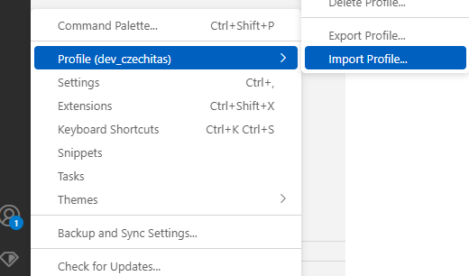

# czechitas-csharp-project template

Vítej, na základě této šablony repozitáře budeš pracovat. Repozitář je tvůj, takže se neboj si upravit vše, jak potřebuješ ;). Mimo lekce si jej klidně beze spěchu proklikej.

| Cesta                    | Popis                                                                                                                                        |
| ------------------------ | -------------------------------------------------------------------------------------------------------------------------------------------- |
| **/manuals**             | Obsahuje šikovné manuály a taháky co jsme splašili z minulých kurzů                                                                          |
| **/ToDoList**             | Hlavní složka tvého repozitáře pro finální projekt, má vlastní [Readme](ToDoList/Readme.md)                                                   |
| **/sandbox**             | Dedikované místo pro procvičování, má vlastní [Readme](sandbox/Readme.md)                                                                    |
| **/wiki**                | Místo, které jsme připravili jako dedikovanou `Wikipedii` pro tento kurz. Prosím začni tady [StartHere](wiki/00%20StartHere.md)              |
| **.editorconfig**        | Soubor zodpovědný za formátování kódu                                                                                                        |
| **.gitattributes**       | Vygenerovaný soubor pro rozeznávání velkoformátových souborů a vynucení jednotného znaku pro konec řádků (Windows a Linux mají odlišný znak) |
| **.gitignore**           | Soubor zodpovědný za ignorování obsahu, který nechceme publikovat na `GitHub`                                                                |
| **csharp3.code-profile** | Předpřipravené nastavení `VSCode`, lze jej importovat vlevo dole                                                       |
| **README.md**            | Tento soubor                                                                                                                                 |
