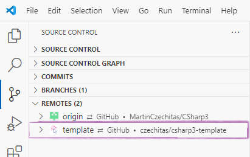
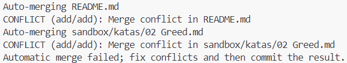
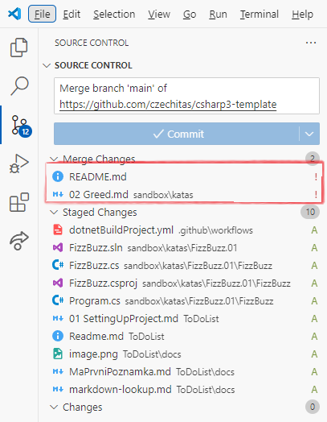
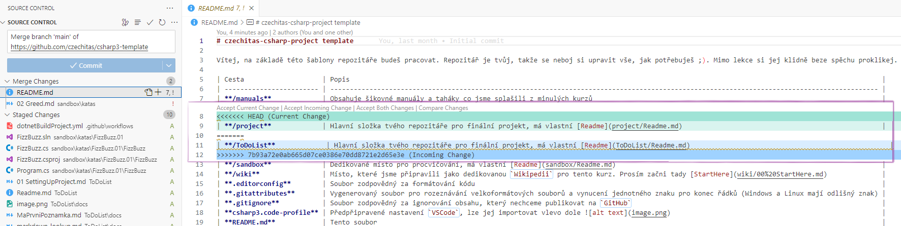
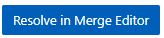
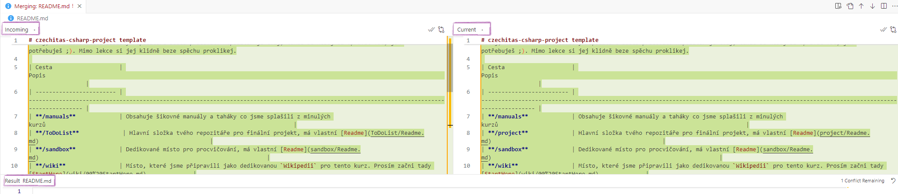
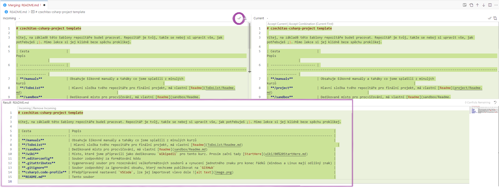
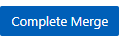
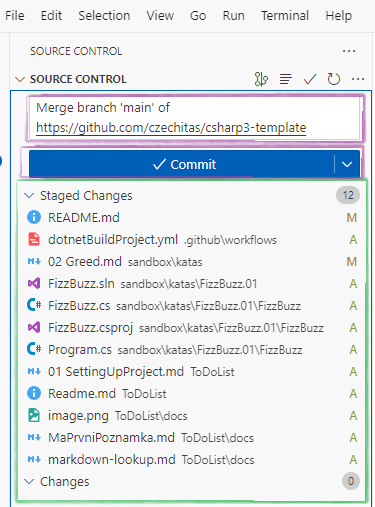

# Jak aktualizovat repozitář z šablony

Potřebujeme tyto dva příkazy, vysvětlení níže.

```git
git remote add template https://github.com/czechitas/csharp3-template
git pull template main --allow-unrelated-histories
```

- [Jak aktualizovat repozitář z šablony](#jak-aktualizovat-repozitář-z-šablony)
  - [Přidání nového remote (stačí provést jednou)](#přidání-nového-remote-stačí-provést-jednou)
  - [Zapracování nejnovějších změn z šablony (při každé aktualizaci - z větve main)](#zapracování-nejnovějších-změn-z-šablony-při-každé-aktualizaci---z-větve-main)
    - [Řešení Merge Conflictů](#řešení-merge-conflictů)

## Přidání nového remote (stačí provést jednou)

Příkazem `git remote add template https://github.com/czechitas/csharp3-template`\
ve tvaru `git remote add <Jméno pro daný remote> <URL repozitáře>`

přidáme nový remote našemu repozitáři.

**Remote** v gitu znamená odkaz na repozitář, který chceme sledovat (trackovat).\
Tímto způsobem jsme tedy získali odkaz na repozitář, ve kterém se nachází C#3 šablona.

Příkaz nám tedy přidá nový odkaz na repozitář `czechitas/csharp3-template` pod názvem `template`. \
Ve VSCode pak uvidíme v `Source Control -> Remotes` nový remote s názvem `template`. Mrkni na obrázek níže.



## Zapracování nejnovějších změn z šablony (při každé aktualizaci - z větve main)

Příkazem `git pull template main --allow-unrelated-histories`\
ve tvaru `git pull <odkud> <kam> <--allow-unrelated-histories = ignoruj, že repozitáře nemají stejnou historii>`\
si načteme aktuální stav šablony v remotu `template` a pokusíme se ho zamergovat do naší hlavní větve `main`.

Ve VSCode pak v `Source Control -> Source Control` uvidíš `Changes`, které se k tobě dostaly zapracováním šablony do tvého repozitáře.\
**V tuto chvíli máš vyhráno! Přidej message commitu, stagni všechny změny, commitni a pushni a máš hotovo!**

**Pokud se ti však ukázalo v konzoli něco podobného jako**



**musíme udělat ještě krok navíc.**

Pokud se něco změnilo v některém souborů šablony a zároveň jsi do stejného souboru zasahovala sama, s největší pravděpodobností nastane `Merge Conflict`!

Ten uvidíme pak v `Source Control -> Source Control`
pod `Merge Changes` (soubory s vykřičníkem). Tyto merge conflicty musíme opravit sami.


### Řešení Merge Conflictů

Kliknutím na soubor se lze podívat, kde jde problém

Zde například v tom, že v šabloně se změnil README.md, kde se přejmenovala složka z **/project** (current change - změna v našem repozitáři) na **/ToDoList** (incoming change - změna ze šablony)

Pro vyřešení problému vpravo dole klikneme na tlačítko `Resolve in Merge Editor` 

Objeví se nám nové okno

vlevo máme `Incoming Change` (změny ze šablony), vpravo `Current Change` (změny v našem repozitáři).\
Pod nimi pak máme `Result`. Tato `Result` oblast nám ukáže, jak bude vypadat konečný soubor README.md.

Poznámka: Pro `Markdown` dokumenty je tento zabudovaný editor trochu slabší, nedokáže zvýraznit pouze ty řádky, kde je problém :( U ostatních typů souborů byste měli vidět zvýrazněné pouze ty řádky, které je třeba opravit (tam kde je konflikt)

V C#3 budeme po vás chtít, abyste si nakupovali šablonu, abychom měli všichni stejný kód.
To uděláme tak, že klikneme na tlačítko `Accept All Changes from Left`, po jehož kliknutí pak v `Result` bude verze derivovaná z šablony (veškeré konflikty se vyřeší kódem ze šablony).


S takto vyřešenými problémy klikneme v pravém dolním rohu na `Complete Merge` 

Tento postup zopakuj pro všechny soubory, ve kterých je Merge Conflict, v source control pak nebude ani jeden soubor s vykřičníky



Nezapomeň na vyplnění zprávy, poté commitni a pushni.
Hotovo!
