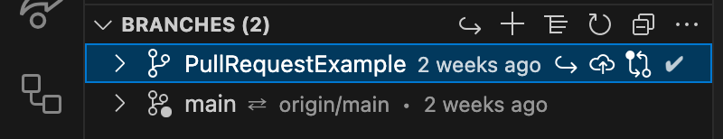
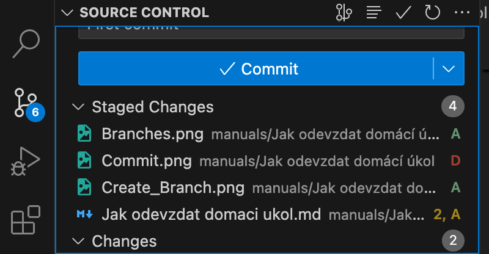
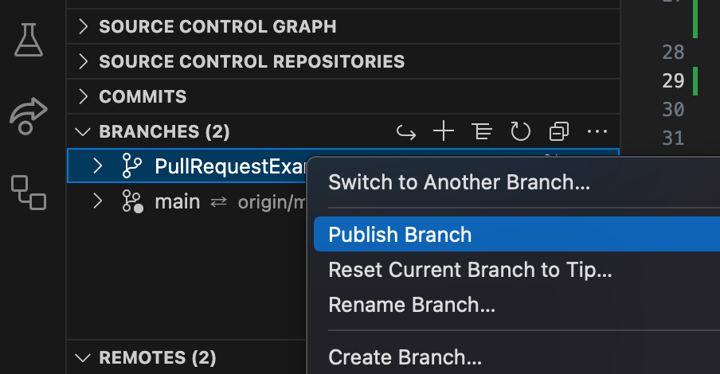
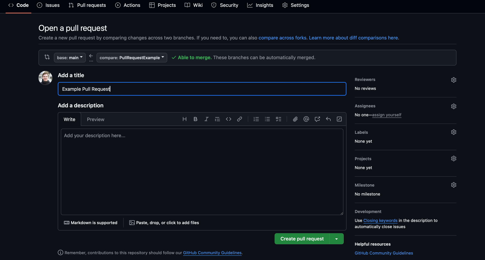
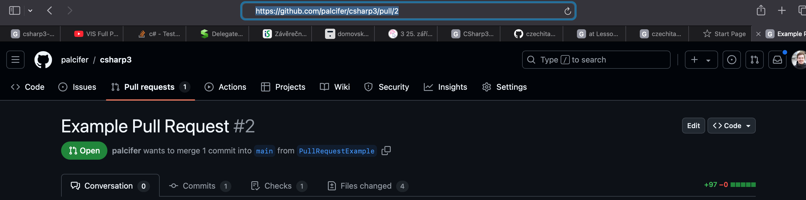
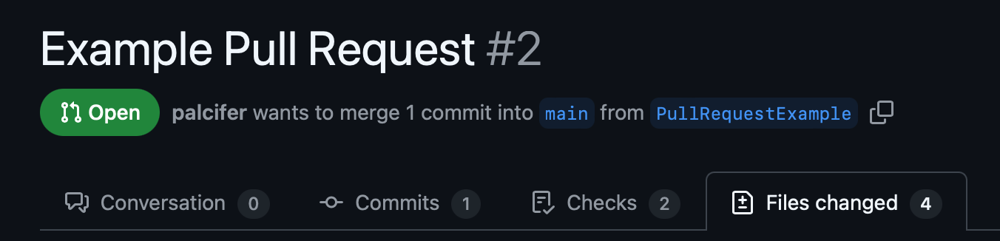

# Jak odevzdat domácí úkol

V tomhle návodu si vysvětlíme, jak si ve VS Code vytvořit `PullRequest` z nové větve a proč to je nejlepší forma odevzdávání domácích úkolů.

- [Jak odevzdat domácí úkol](#jak-odevzdat-domácí-úkol)
  - [Vytvoření nové vlastní větve](#vytvoření-nové-vlastní-větve)
  - [Vytvoření Pull Requestu](#vytvoření-pull-requestu)
  - [Proč je to nejlepší způsob odevzdávaní úkolů?](#proč-je-to-nejlepší-způsob-odevzdávaní-úkolů)

## Vytvoření nové vlastní větve

Ve Visual Stiudiu Code ve přepneme do třetí záložky `Source Control`. V ní vidíme v záložce `Source Control` aktuální změny našeho repozitáře a v záložce `Branches` lokální větve. Vytvoříme si z naší hlavní větve Main novou větev kliknutím pravým tlačítkem myši na větev main a kliknutím na `Create branch`.

Zvolíte si jméno vaší větve (například PullRequestExample v mém případě, nebo Assignment_5.1 u vás) a stisknete Enter.
Následně zvolíte `Create & Switch to Branch`, takže se vám větev vytvoří a rovnou vás to na ní přepne.

Následně uděláme commit našich změn v nově vytvořené větvi:

Tím, že jsme naší větev jenom teď vytvořili, tak ji máme jenom u sebe. Aby se nahrala do globálního repozitáře, tak ji tam musíme publikovat.

Zvolíme možnost `Publish <name_of_the_branch> to Origin`. Tím budeme mít v našem globálním repozitáři Origin i naší novou větev.

## Vytvoření Pull Requestu

Teď budeme commitovat do naší nové větve až do bodu, kdy budeme s naším zadánim natolik spokojeni, že by jsme tyhle změny chtěli mít i v mainu. Ale pozor! Namísto Merge do větve main si vytvoříme Pull Request. Ten dělá vesměs to stejný, změny se po schválení objeví ve větvi main, jenomže co je tady důležité je právě to schválení. To by měl provésť někdo jiný než autor změn: v reálné společnosti to je většinou vlastník nebo architekt aplikace, tady je to spíše kouč.

Poďme tedy na samotný Pull Request. Vytvoříme ho pravým kliknutím na novo vytvořenou větev v záložce Branches.

Zvolíte si, do ktorého vzdáleného repozitáře (Remotes) chcete tenhle Pull Request zavést. Pokud si pravidelně aktualizujete šablonu, tak by ste tam měli mít váš repozitář a template. Zvolte váš repozitář. To by vás mělo okamžite přesměrovat do webového prohlížeče na otevření vašeho Pull Requestu.

Zde napíšete název, případně komentář. Co je ale důležitejší, můžete si po sobě skontrolovat vaše změny a v případe jakékoli chyby nebo nezrovnalosti doručit opravu jako nový commit.

Následně levý klik na zelené tlačidlo Open pull request a hotovo. Vytvořený Pull Request se objeví na obnovené stránce a vy nám do domácího úkolu jen skopírujete URL adresu vašeho PR.

## Proč je to nejlepší způsob odevzdávaní úkolů?

Ve vytvořeném Pull Requestu si vy i my můžeme přehledně ověřit nově přidaný kód a konfigurační soubory, ktoré se týkají jenom vašeho úkolu. Koneckonců, když vytváříte PR pro váš úkol, tak by nic jiného obsahovat ani neměl. Můžete se navíc podívat na vaše testy a zdali sa vaše větev vůbec zbuildí (protože Martin proaktivně zavedl CI/CD pipeline, ale to je mimo tenhle návod).

Co je ale podstatné pro náš případ, můžete velmi jednoduše komentovat zavedené změny, vy na ně můžete reagovat, případně rovnou změnit vaší implementaci podle komentáře kouče (stále platí, že do Pull Requestu můžete commitovat změny). A proto je to podle mně nejlepší způsob, jak vám při tak zložitých zadáních, jako ďeláte právě teď, víme poskytovat tu nejlepší možnou zpětnou vazbu.

Jo a jestli jste se někdy setkali s Merge Requestami, tak to je to stejný, jenom pro GitLab :-)
