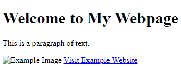

# HTML

`HTML (Hypertext Markup Language)` is a standard markup language used for creating the structure and presentation of web pages. It is the foundation of the World Wide Web and is interpreted by web browsers to display content to users.

[HTML Tutorial](https://developer.mozilla.org/en-US/docs/Learn/HTML/Introduction_to_HTML/Getting_started), [W3Schools HTML Tutorial](https://www.w3schools.com/html/)\
[HTML Reference](https://developer.mozilla.org/en-US/docs/Web/HTML)\
[HTML Example Code](https://www.w3schools.com/html/html_examples.asp)\
[HTML Course](https://www.codecademy.com/learn/learn-html)

> HTML code consists of a series of elements, each represented by a pair of tags enclosing content. Tags are keywords enclosed in angle brackets (`< >`) that define the structure and behavior of elements. Elements can be nested inside one another to create a hierarchical structure, and they can have attributes that provide additional information or modify their behavior.

A Basic HTML element anatomy looks like this:


You can have a look at the following HTML code snippet to get a basic understanding of how HTML is structured:
you can write comments in html in the following format `<!-- comment here -->`

```html
<!-- EXAMPLE: Anything inside these tags is considered a comment. -->
<!DOCTYPE html>                                  <!--Defines the document type and version of HTML--> 

<html>                                           <!--Root element of an HTML document-->
  <head lang="en">                               <!--Contains metadata and links to external resources-->
    <title>My Webpage</title>                    <!--Title of the webpage-->
  </head>
  <body>                                         <!--Contains the visible content of the webpage-->
    <h1>Welcome to My Webpage</h1>               <!--Heading level 1-->
    <p>This is a paragraph of text.</p>          <!--Paragraph of text-->
        <!--Image element with source and alt text-->
    <a href="https://www.example.com">Visit Example Website</a> <!--Anchor element for hyperlink-->
  </body>
</html>
```



Here are the key aspects and concepts of HTML:

1. **Markup Tags**: HTML is based on a set of markup tags enclosed in angle brackets (`< >`). `Tags` define the structure and semantics of the content within a web page. They can be opening tags (`<tag>`) or self-closing tags (`<tag />`).

2. **Elements**: HTML tags, when combined with their content, form HTML elements. `Elements` represent different parts of a web page, such as headings, paragraphs, images, links, tables, forms, and more.

3. **Hierarchy and Nesting**: HTML elements can be nested inside one another to create a `hierarchical structure`. Some elements can only appear within specific parent elements, following a defined structure.

4. **Attributes**: HTML elements can have attributes that provide additional information or modify their behavior. `Attributes` are specified within the opening tag of an element and consist of a name and a value (`attribute="value"`).

5. **Semantic Meaning**: HTML introduces a set of semantic tags that convey the meaning and purpose of the content they enclose. For example, `<header>`, `<nav>`, `<article>`, `<section>`, and `<footer>` are semantic tags that help define the structure of the page and improve accessibility.

6. **Styling and Presentation**: HTML provides a way to define the visual appearance of elements through `CSS (Cascading Style Sheets)`. CSS rules can be applied to HTML elements to control aspects like colors, fonts, layout, and more.

7. **Hyperlinks**: HTML allows the creation of hyperlinks (`<a>` tags) that connect different web pages or resources. Users can click on a link to navigate to another page or trigger specific actions.

8. **Forms**: HTML provides form elements (`<form>`, `<input>`, `<select>`, etc.) to collect and submit user input, such as text, checkboxes, radio buttons, and more.

9. **Multimedia**: HTML supports the inclusion of multimedia content, such as images (``), audio (`<audio>`), video (`<video>`), and embedded content from external sources like YouTube or social media platforms.
